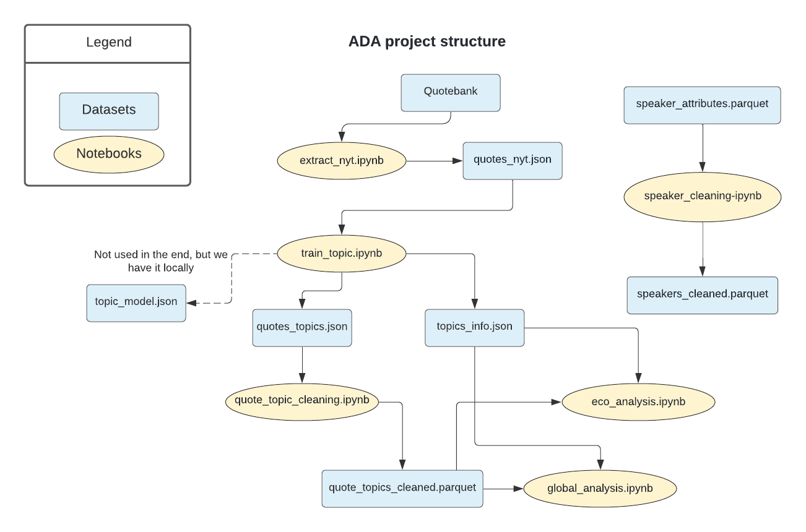

# A hierarchical study of American newspaper quotes and speaker characteristics.

Here is the [data story](https://manonboissat.github.io/Data-diggers/) related to tihs repository.

## Abstract

American newspapers cover all kinds of topics from politics to sports, business, environment, etc... At the highest level, one could ask which topics people are mostly interviewed about. One way to answer this question is by trying to infer the theme each Quotebank citation is treating in an unsupervised manner and draw a distribution over some labels/classes representing these themes. Once all citations are classified with a certain confidence probability, a lower-level question could be: for each class, is it possible to relate the quotes’ frequency with some real world event? For instance, could an increase of citations about economics forecast some variation in the American stock market? 
In addition, using these classified quotes combined with additional data on the authors characteristics, we would like to compare the features of the authors of a particular citation class and try to find recurrent attributes or relevant features.

## Research Questions

What are interviewed people mostly talking about in newspapers?
Are there subjects for which there are less quotes? Why?
Can we correlate real world events with newspapers’ quotes?
What common characteristics do the authors of citations treating a certain topic have? Do they have recurrent features?

## Proposed additional datasets
For the purpose of trying to find similarities between speakers, we will need more information about them, that’s why we will take advantage of the made available metadata about the speakers of the Quotebank dataset. 
In addition, with the aim of comparing the quotes classified as treating economics, we will make use of the Dow Jones Industrial Average. This will be done using a csv file containing indices for each day since 2013. 
Additional libraries used:
Pandas,
Numpy,
BERTopic,
bz2,
Dask,
Json

## Methods
In order to handle Quotebank in its size, we first tried to use Dask which is an open library built to operate on large datasets while keeping a low memory footprint by performing lazy computation. This means that it does not compute tasks directly but saves the set of input and executes functions only on demand through the function .compute(). With the latter call, Dask executes the calculation cleverly while minimizing the amount of data stored in memory and parallelizing tasks as much as possible. However, with the available computational power, we were not able to fit the model on a too large dataset. Therefore, we simply extracted the data line by line as one can find in the notebook "extract_nyt.ipynb".

We choose to pick only New York Times quotes because it represents well the American newspapers, and is a reasonable sample of our data. We use BERTopic to perform the classification resulting in the quotes labeled with one single topic. Indeed, we were not able to compute confidence probabilities for the labeling because of the limited computational power.
We are then be able to separate the data according to their label and process the economics quotes separately.

For all topics linked with economics, we report the frequency of citations and compare this frequency with real world event’s timeline of th Dow Jones index.

Another axis of study consists in performing some analysis on the speakers’ features. We first enrich quotebank with metadata on the speakers. We then try to infer what features makes a speaker more likely to be interviewed and cited in the New York Times.

The structure of our code can be found in the image [below](#repo-struct).

## Organization

| Manon Boissat | Téo Goddet | Sébastien Jeanfavre | Michaël Tasev |
| ------------------- | ------------------- | ------------------- | ------------------- |
| Data cleaning | Data extraction | BERTopic training | Dow Jones handling |
| Features and topics analysis(50%) | Full dataset handling | Topic analysis (50%) | Economic analysis|
| PCA | Data story (50%) | Data story (20%) | README |
| Data story (30%) | 

## Repo structure {#repo-struct}

## Conclusion

In this study, we had the chance to work on a brand new dataset freshly coming out of the DLAB at EPFL containing quotes from many English-speaking newspapers. The massive amount of available data led us to the choice of focusing our study on the New York Times only. We were able to make some statistics about the dataset augmented with some wikidata on the authors of the quotes. One of the challenges was to cluster the quotes into topics in an unsupervised manner using BERTopic library and training a model able to label the quotes with precise topics. Additionally, we encountered several struggles: 
- Comparing a massive and economically inertial index such as the Dow Jones, which is more likely to influence the newspapers instead of the opposite
- handling real-world data that doesn’t fit in memory
- PCA and how to handle large number of columns
- Regression

